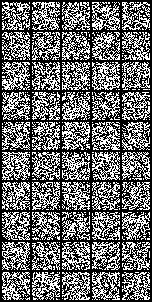

# MNIST Diffusion


A lightweight PyTorch implementation denoising diffusion on NMIST handwritten digits. Supports:
- DDPM (1000 steps) and DDIM (Fast, 50 steps) samplers.
- Classifier-Free Guidance (CFG) for generating specific digits.
- Swappable backbones (UNet & DiT/Transformer).


## Training
Install packages
```bash
pip install -r requirements.txt
```
Start default setting training 
```bash
python train_mnist.py
```

Train a transformer model.
```bash
python train_mnist.py --model_type transformer
```

Feel free to tuning training parameters, type `python train_mnist.py -h` to get help message of arguments.

## Transformer model
The model breaks the input image into patches. The patch size is very important. If it is too large, the training would never work. Patch size of 2 is a good starting point for MNIST.

## Sampling
Load a model checkpoint created previously
```bash
python sample.py --ckpt results/steps_00013601.pt --n_samples 16 --output_file my_samples.png
```

Use DDIM sampler (Faster)
```bash
python sample.py --ckpt results/steps_00013601.pt --n_samples 16 --sampler ddim --output_file my_samples.png
```


## Reference
A neat blog explains how diffusion model works(must read!): https://lilianweng.github.io/posts/2021-07-11-diffusion-models/

The Denoising Diffusion Probabilistic Models paper: https://arxiv.org/pdf/2006.11239.pdf 

A pytorch version of DDPM: https://github.com/lucidrains/denoising-diffusion-pytorch

